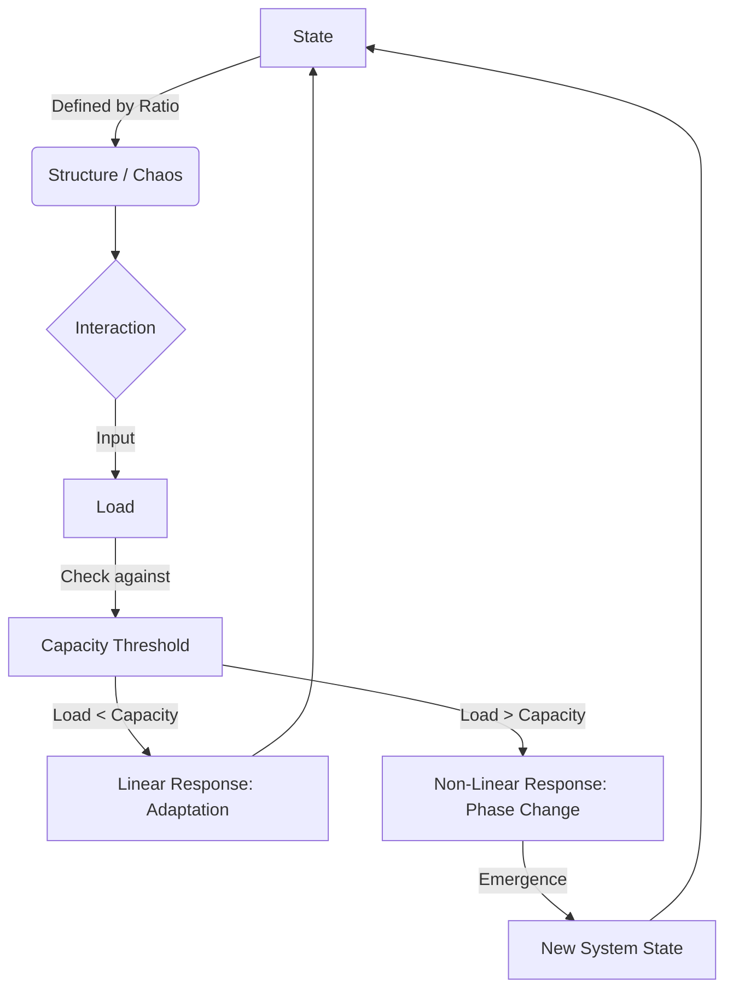

# The Proportional Interaction Framework (PIF)

**A Unified Systems Architecture for Understanding Emergence**

---

## The Problem: A Fragmented Understanding

Our knowledge of the universe is scattered across disciplines. Physicists study particles. Chemists study molecules. Biologists study cells. Cognitive scientists study minds. Each domain has developed its own vocabulary, its own models, its own explanatory frameworks.

But reality is not fragmented. The atom does not "end" where the molecule "begins." Life does not emerge from chemistry through magic. Consciousness is not disconnected from biology.

We need a **meta-theory**—a universal logic that reveals the deep patterns connecting the microscopic to the macroscopic, the simple to the complex, the inanimate to the living and thinking.

## The Solution: A Unifying Lens

The **Proportional Interaction Framework (PIF)** offers a lens for understanding how systems of any kind—physical, biological, cognitive, social—organize, interact, adapt, and transform.

PIF is not a theory about physics, or chemistry, or biology. It is a **General Systems Theory** that proposes a set of patterns that may govern:

- **Structure and Change:** How systems maintain coherence while responding to disruption
- **Interaction and Compatibility:** How agents couple based on resonance, scale, and fit
- **Adaptation and Transformation:** How systems evolve through capacity thresholds

## The Core Insight

At its heart, PIF suggests a organizing principle: **systems may be understood not only by what they are, but by the ratios that govern their behavior.**

- A system's **state** can be characterized as the ratio of internal cohesion to external disruption
- An interaction's **effectiveness** relates to the degree of compatibility versus mismatch
- A transformation's **trigger** corresponds to the ratio of load to capacity

PIF proposes that these proportional relationships recur across scales—from atoms to ecosystems, from neural networks to economies, in moments of stability and moments of phase transition.

### The Cycle Visualized

## Why This Matters

The Proportional Interaction Framework may provide:

1. **Unification:** A common language to bridge quantum mechanics, thermodynamics, biology, and cognition
2. **Pattern Recognition:** A lens for identifying when systems may adapt and when they may transform
3. **Design Principles:** Heuristics for engineering resilient, adaptive systems across domains
4. **Conceptual Integration:** A mental model for recognizing structural patterns that recur across scales of organization

## What You'll Find Here

This repository is organized into three main sections:

### [Core Framework](/core-framework)
The foundational principles of PIF, articulated as universal systems logic:
- **Universal Principles:** The three laws governing all complex systems
- **The Cycle of Emergence:** How state, interaction, and response create feedback loops

### [Case Studies](/case-studies)
Demonstrations of PIF applied across domains:
- **Biological Emergence:** Life as a system state where organization exceeds dissipation
- **Cognitive Emergence:** Consciousness as an information integration phase transition
- **Physical Foundation:** Thermodynamics and gravity as empirical proof-of-concept

### [Definitions](/definitions)
Precise articulations of key concepts:
- **Capacity:** The limit of a system's ability to distribute stress or information
- **Resonance:** Efficient coupling through compatibility and fit
- **State:** A dynamic ratio of structure versus chaos

---

## Getting Started

Begin with the [Universal Principles](/core-framework/universal-principles.md) to understand the three core laws, then explore the [Cycle of Emergence](/core-framework/the-cycle-of-emergence.md) to see how these principles create feedback loops that drive evolution and transformation.

For concrete examples, dive into the [Case Studies](/case-studies) to see how the same logic manifests across physical, biological, and cognitive domains.

To understand how PIF builds on prior systems science, read the [Historical Lineage](/core-framework/historical-lineage.md) connecting this work to General Systems Theory, Cybernetics, and Self-Organized Criticality.

## Current Limitations & Research Horizons

While PIF offers a compelling lens for understanding cross-domain patterns, it is important to acknowledge its current limitations:

### 1. Measurement Challenges

Defining and quantifying ratios like "Organization Rate/Dissipation Rate" or "Structure/Chaos" in real-world complex systems remains an open research problem. While these concepts are conceptually clear, operationalizing them with the precision achieved in physics is non-trivial. Each domain requires careful work to identify appropriate metrics and validation methods.

### 2. Isomorphism vs. Mechanism

PIF identifies **structural similarities** (isomorphisms) across domains—patterns that repeat at different scales. However, structural similarity does not necessarily imply identical underlying mechanisms. 

For example, a liquid boiling and a cell dividing may both exhibit threshold-crossing behavior (Load > Capacity → Phase Transition), but the physical processes are fundamentally different. PIF suggests these are **analogous** structures, not **identical** processes.

This distinction is crucial: PIF is a framework for recognizing patterns, not a claim that "everything is the same thing."

### 3. Predictive Precision

PIF currently offers primarily **qualitative predictions** (e.g., "when load exceeds capacity, transformation is forced"). Achieving quantitative, falsifiable predictions comparable to those in physics remains an aspiration. 

The framework's value lies in:
- Guiding intuition about system behavior
- Suggesting where to look for thresholds and transitions
- Providing a common vocabulary across disciplines

Future work must develop domain-specific instantiations with measurable variables and testable hypotheses.

### 4. Scope and Applicability

Not all systems may be well-described by proportional logic. PIF is most applicable to:
- Systems with identifiable structure and disruption forces
- Systems that exhibit threshold behavior
- Systems where feedback loops and adaptation are central

Its applicability to fundamentally stochastic or quantum-indeterminate systems remains an open question.

## Contributing

This is a living framework. If you see applications to new domains, refinements to the principles, or additional case studies that strengthen the theory, your contributions are welcome.

## License

This work is licensed under [Creative Commons Attribution 4.0 International (CC-BY-4.0)](LICENSE).

---

*What if the patterns we see at one scale echo at others? What if thresholds, ratios, and transformations are not accidents, but structural features of complex systems? PIF invites you to look for these patterns—and decide for yourself.*

