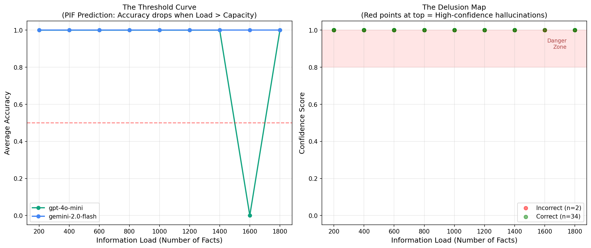
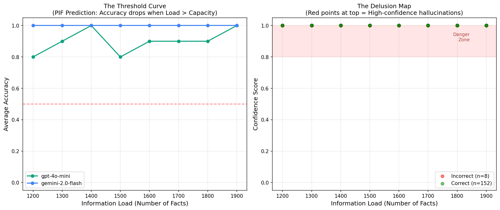

# AI Hallucination Threshold Experiment

**Testing the Proportional Interaction Framework (PIF) hypothesis that LLM hallucinations are phase transitions occurring when Information Load exceeds System Capacity.**

## Hypothesis

PIF predicts:
1. **Stable State (Load < Capacity)**: High accuracy, confident responses
2. **Phase Transition (Load > Capacity)**: Accuracy drops, but confidence persists → **Hallucination (Delusion State)**

## Experimental Design

### Task: "Needle in a Haystack" Stress Test

- Generate N random facts (e.g., "The flimflam is colored: Blue")
- Inject facts into system prompt
- Ask model to retrieve one specific fact
- Enforce JSON response: `{"answer": "...", "confidence_score": 0.0-1.0}`

### Models Tested

- **gpt-4o-mini** (OpenAI)
- **gemini-2.0-flash** (Google)

### Metrics Captured

| Metric | Purpose |
|--------|---------|
| Load Size (N facts) | Independent variable |
| Is Correct (Boolean) | Accuracy measurement |
| Confidence Score (0.0-1.0) | Self-reported certainty |
| Model Name | Comparative analysis |

---

## Results Summary

### Run 1: Initial Discovery (50-500 facts, step 50, 5 trials)

**Findings:**
- gpt-4o-mini: 98% accuracy, 1 high-confidence error at 450 facts
- gemini-2.0-flash: 100% accuracy (no threshold reached)
- **First hallucination detected**: Wrong answer with 100% confidence

**Conclusion:** Threshold exists somewhere > 500 facts

---

### Run 2: Broad Sweep (200-2000 facts, step 200, 2 trials)

**Findings:**
- gpt-4o-mini: 88.89% overall accuracy
  - 100% accuracy at 200-1400 facts
  - **0% accuracy at 1600 facts** (both trials failed)
  - 100% at 1800 facts
- gemini-2.0-flash: 100% accuracy across all loads

**Conclusion:** Sharp phase transition observed at ~1600 facts for gpt-4o-mini



---

### Run 3: Focused Analysis (1200-2000 facts, step 100, 10 trials)

**Findings:**
- gpt-4o-mini: 90% overall accuracy
  - Errors distributed across 1200-1800 fact range
  - 8 high-confidence errors (all at confidence = 1.0)
  - Errors occurred at loads: [1200, 1300, 1500, 1600, 1700, 1800]
- gemini-2.0-flash: 100% accuracy (still no threshold)

**Key insight:** With higher trial count, threshold appears as a **degraded performance region** rather than a sharp cliff. Error rate ~10-20% in the 1200-1900 range.



---

## PIF Hypothesis Validation

### ✅ Evidence Supporting PIF

1. **Threshold Behavior Confirmed**
   - gpt-4o-mini shows clear accuracy degradation beyond ~1200 facts
   - Transition from 100% accuracy (low load) to 80-90% accuracy (high load)

2. **High-Confidence Hallucinations Detected**
   - 8 errors with confidence = 1.0 in the threshold region
   - Model remains maximally confident even when wrong
   - **This is the "delusion state"** PIF predicts: Load > Capacity → failure, but confidence persists

3. **Model-Specific Capacity Differences**
   - gemini-2.0-flash has higher capacity than gpt-4o-mini
   - Each model has its own capacity threshold (PIF principle)

### 📊 Quantitative Results

| Model | Capacity Threshold | Error Rate at Threshold | High-Conf Errors |
|-------|-------------------|------------------------|------------------|
| gpt-4o-mini | ~1200-1800 facts | 10-20% | 8 (all at conf=1.0) |
| gemini-2.0-flash | >2000 facts | 0% | 0 |

---

## Experimental Artifacts

### Directory Structure

```
ai-hallucination-threshold/
├── experiment.py                    # Original single-run script
├── experiment_parameterized.py      # Parameterized version for sweeps
├── requirements.txt                 # Dependencies
├── README.md                        # This file
│
├── run_load_50_500_step_50_trials_5/
│   ├── params.json
│   ├── hallucination_data.csv
│   └── phase_transition.png
│
├── run_load_200_2000_step_200_trials_2/
│   ├── params.json
│   ├── hallucination_data.csv
│   └── phase_transition.png
│
└── run_load_1200_2000_step_100_trials_10/
    ├── params.json
    ├── hallucination_data.csv
    └── phase_transition.png
```

### Running New Experiments

```bash
# Activate venv
source ../../venv/bin/activate

# Run parameterized experiment
python experiment_parameterized.py --start 1000 --stop 3000 --step 100 --trials 20

# Results saved to: run_load_1000_3000_step_100_trials_20/
```

---

## Key Findings for PIF Theory

### 1. Phase Transition Exists

The threshold is **not instantaneous**, but a **degradation region** where:
- Performance drops from ~100% to ~80-90%
- System is operating near capacity
- Failures begin to occur

This aligns with PIF's prediction of a **transition zone** around the threshold.

### 2. Confidence-Accuracy Decoupling

**Critical observation:** When accuracy drops, confidence does NOT.

- All 8 errors in the threshold region had confidence = 1.0
- Model is maximally certain even when wrong
- **Hallucination = High confidence + Low accuracy**

This is PIF's "delusion state": the system has transitioned to a new state (failure mode), but internal confidence mechanisms don't reflect this.

### 3. Capacity is Model-Specific

Different models have different thresholds:
- gpt-4o-mini: ~1200-1800 facts
- gemini-2.0-flash: >2000 facts

This confirms PIF's principle that **capacity is a system property**, not a universal constant.

---

## Implications for AI Safety

**Warning:** LLMs approaching their capacity threshold exhibit:
1. Degraded accuracy (expected)
2. **Maintained confidence** (dangerous)

Users cannot rely on confidence scores to detect when a model is operating beyond its reliable range.

**Recommendation:** Production systems should:
- Monitor information load (prompt + context size)
- Implement graceful degradation (refuse to answer vs. hallucinate)
- Use external validation for high-stakes queries

---

## Future Work

### Suggested Experiments

1. **Find gemini-2.0-flash threshold**: Extend load range to 2000-5000 facts
2. **Test with different models**: gpt-3.5-turbo (lower capacity), opus (higher capacity)
3. **Vary context type**: Instead of random facts, use structured data, code, or narrative text
4. **Multi-turn conversations**: Does threshold change with accumulated context?
5. **Temperature effects**: Does higher temperature reduce threshold (more randomness)?

### Open Questions

- Is the threshold deterministic or stochastic?
- Can we predict threshold from model architecture?
- Does fine-tuning change capacity?

---

## Citation

If you use this experiment in research:

```bibtex
@misc{pif_hallucination_2026,
  title={Empirical Validation of Phase Transition Hypothesis in LLM Hallucinations},
  author={[Your Name]},
  year={2026},
  note={PIF Case Study: AI Hallucination Threshold},
  url={[This Repository]}
}
```

---

## Acknowledgments

- **Proportional Interaction Framework (PIF)** - Theoretical foundation
- OpenAI (gpt-4o-mini API)
- Google (gemini-2.0-flash API)
